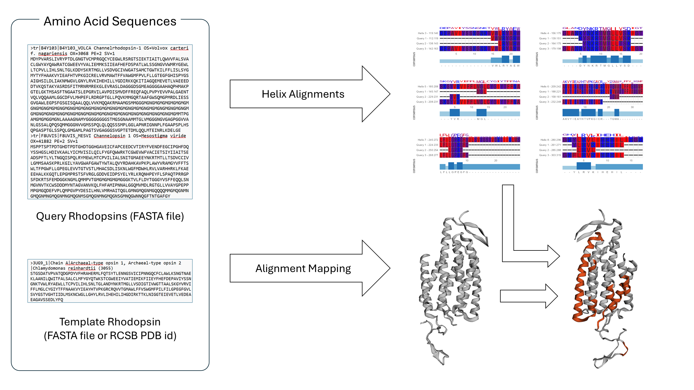

<!-- README.md is generated from README.Rmd. Please edit that file -->

```{r, include = FALSE}
knitr::opts_chunk$set(
  collapse = TRUE,
  comment = "#>",
  fig.path = "man/figures/README-",
  out.width = "100%"
)
```

# RhodopXin

## Description

`RhodopXin` is an R package designed for the exploratory analysis and visualization of rhodopsin protein structures, focusing on template-based helix alignments and mapping these alignments onto 3D structures of well-characterized template rhodopsins. Currently, there are no pre-existing R tools that directly work with rhodopsins.

By leveraging structural templates, the package aligns helical regions of rhodopsins and projects these alignments onto the corresponding 3D template structure. This workflow facilitates structural insights and comparative studies of rhodopsins, enabling researchers to understand conserved features and variations across different members of this protein family.

The package is particularly valuable in homology modeling by offering a streamlined approach to guide the construction of 3D models of rhodopsin variants. Accurate helix alignments ensure that key structural motifs are properly positioned, while the 3D mapping aids in refining and validating model geometries. 

`RhodopXin` was developed using R version 4.4.1 (2024-06-14 ucrt), Platform: x86_64-w64-mingw32/x64, and Running under: Windows 11 x64 (build 22631)


## Installation

To install the latest version of the package:

``` r
install.packages("devtools")
library("devtools")
devtools::install_github("calicac001/RhodopXin", build_vignettes = TRUE)
library("RhodopXin")
```

To run the shiny App:

``` r
runRhodopXin()
```

## Overview

To see an overview of the package, run:

``` r
ls("package:RhodopXin")
data(package = "RhodopXin") 
browseVignettes("RhodopXin")
```

`RhodopXin` contains the following main functions:

1. ***loadSequence*** - takes in a FASTA file path and creates an AAStringSet object out of it

2. ***loadFromRcsb*** - takes in a RCSB PDB id and returns an AAStringSet object of the structure's sequence

3. ***createHelixAlignments*** - performs pairwise alignment between each of the template rhodopsin's helices and each of the query sequences, allowing users to see the conservation of residues across a given helix.

4. ***visualizeHelixAlignments*** - takes the output of ***createHelixAlignments*** and create visual representations of the alignments

5. ***visualizeHelixMapping*** - map the conserved residues from ***createHelixAlignments*** into the 3D structure of the given template rhodopsin

Additionally, the following helper functions are present but not exported:

- ***helixSequences*** - returns a list of AAString objects containing the sequence info of the given template rhodopsin's helices
- ***findHelices*** - finds all the helices in a PDB structure given and then return a dataframe for the start and end positions of each helix.
- ***validateRcsbId*** - validates the RCSB id input given by the user so that the PDB structure can be fetched in the RCSB database
- ***getPDBstruct*** - retrieve the PDB file for given RCSB id
- ***templateMapping*** - processes the `template_ranges` dataframe returned by ***createHelixAlignments*** so it reflects the mapping positions of the alignments to the template's resolved structure
- ***resolvedMapDf*** - creates a dataframe containing the the residue numbers in the full sequence of the template and the corresponding residue numbers in the resolved structure when missing residues are taken into account

The package also contains two `.fasta` files, processed into datasets, `template_rhodopsins` and `sample rhodopsins`, by the `loadSequence` function. See the package vignette for more details.

An overview of `RhodopXin` is illustrated below.


## Contributions

The author of the package is Chloe Nichole Calica. The author wrote the functions described above while contributions from external packages and sources are outlined below:

- `bio3D` 
  - fetch PDB structures and sequence in ***loadFromRcsb()***
  - read PDB files in ***findHelices***,  
  - write PDB files in ***getPDBstruct***
- `Biostrings` 
  - construct AAStringSet objects in ***loadSequence()***, ***loadFromRcsb()***, ***helixSequences***, ***resolvedMapDf***
  - extract sequence given start and end positions in ***helixSequences***
  - extract sequence of the resolved template structure in ***resolvedMapDf***
- `DECIPHER` - combining pairwise alignments of multiple queries in ***createHelixAlignments***
- `pwalign` - create pairwise alignments between template and query rhodopsins in ***createHelixAlignments*** and between the full and resolved sequence of the template rhodopsin in ***resolvedMapDf***
- `rPDBapi` get information on PDB structures in ***validateRcsbId***

- ***templateMapping*** uses `purrr`, `tibble`, `tidyr` and `dplyr` for dataframe processing of the mapped positions in the resolved structure of the template rhodopsin.
- ***visualizeHelixAlignments*** uses `aplot`, `ggplot2`, `ggmsa` and `patchwork` to create the combined visualization of the helix alignments
- ***visualizeHelixAlignments*** uses `dplyr` and `r3dmol` to create visualizations of the mapped alignments into the 3D structure of the template rhodopsin.
- the shiny application was created using the following packages: `shiny`, `shinycssloaders`, `shinyjs`, and `shinythemes`

OpenAI's ChatGPT was utilized during the development of this package in terms of optimizing/debugging functions and styling the elements in the R shiny app.


## References
Aboyoun P, Gentleman R (2024). _pwalign: Perform pairwise sequence alignments_.doi:10.18129/B9.bioc.pwalign <https://doi.org/10.18129/B9.bioc.pwalign>, R package version 1.2.0, <https://bioconductor.org/packages/pwalign>.

Attali D (2021). _shinyjs: Easily Improve the User Experience of Your Shiny Apps in Seconds_. R package version 2.1.0, <https://CRAN.R-project.org/package=shinyjs>.

Attali D, Sali A (2024). _shinycssloaders: Add Loading Animations to a 'shiny' Output While It's Recalculating_. R package version 1.1.0, <https://CRAN.R-project.org/package=shinycssloaders>.

Chang W, Cheng J, Allaire J, Sievert C, Schloerke B, Xie Y, Allen J, McPherson J, Dipert A, Borges B (2024). _shiny: Web Application Framework for R_. R package version 1.9.1, <https://CRAN.R-project.org/package=shiny>.

Chang W (2021). _shinythemes: Themes for Shiny_. R package version 1.2.0, <https://CRAN.R-project.org/package=shinythemes>.

del Val, C., Royuela-Flor, J., Milenkovic, S., & Bondar, A.-N. (2014). _Channelrhodopsins: A bioinformatics perspective_. Biochimica et Biophysica Acta (BBA) - Bioenergetics, 1837(5), 643–655. https://doi.org/10.1016/j.bbabio.2013.11.005

Grant B.J., Rodrigues A.P.C., ElSawy K.M., McCammon J.A., Caves L.S.D. (2006). _Bio3D: An R package for the comparative analysis of protein structures_. <http://thegrantlab.org/bio3d/>

H. Wickham. _ggplot2: Elegant Graphics for Data Analysis_. Springer-Verlag New York, 2016.
  
Korkmaz S, Yamasan B (2024). _rPDBapi: A Comprehensive Interface for Accessing the Protein Data Bank_. R package version 2.1.1, <https://CRAN.R-project.org/package=rPDBapi>.

L Zhou, T Feng, S Xu, F Gao, TT Lam, Q Wang, T Wu, H Huang, L Zhan, L Li, Y Guan, Z Dai, G Yu. _ggmsa: a visual exploration tool for multiple sequence alignment and associated data_. Bioinformatics. 2022, 23(4):bbac222. 10.1093/bib/bbac222

Müller K, Wickham H (2023). _tibble: Simple Data Frames_. R package version 3.2.1, <https://CRAN.R-project.org/package=tibble>.

OpenAI. (2024). ChatGPT (November 2024 version). Retrieved from https://chat.openai.com

Pagès H, Aboyoun P, Gentleman R, DebRoy S (2024). _Biostrings: Efficient manipulation of biological strings_. doi:10.18129/B9.bioc.Biostrings <https://doi.org/10.18129/B9.bioc.Biostrings>, R package version 2.73.1, <https://bioconductor.org/packages/Biostrings>.

Pedersen T (2024). _patchwork: The Composer of Plots_. R package version 1.3.0, <https://CRAN.R-project.org/package=patchwork>.

Silva, A. (2022) _TestingPackage: An Example R Package For BCB410H_. <https://github.com/anjalisilva/TestingPackage>.

Su W, Johnston B (2021). _r3dmol: Create Interactive 3D Visualizations of Molecular Data_. R package version 0.1.2, <https://CRAN.R-project.org/package=r3dmol>.

Wickham, H., François, R., Henry, L., Müller, K., Vaughan, D. (2023). _dplyr: A Grammar of Data Manipulation_. <https://dplyr.tidyverse.org>.

Wickham H, Henry L (2023). _purrr: Functional Programming Tools_. R package version 1.0.2, <https://CRAN.R-project.org/package=purrr>.

Wickham H, Vaughan D, Girlich M (2024). _tidyr: Tidy Messy Data_. R package version 1.3.1, <https://CRAN.R-project.org/package=tidyr>.

Wright ES (2016). _“Using DECIPHER v2.0 to Analyze Big Biological Sequence Data in R.”_ The R Journal, *8*(1), 352-359.

Yu G (2024). _aplot: Decorate a 'ggplot' with Associated Information_. R package version 0.2.3, <https://CRAN.R-project.org/package=aplot>.

## Acknowledgements

This package was developed as part of an assessment for 2024 BCB410H: Applied Bioinformatics course at the University of Toronto, Toronto, CANADA. `RhodopXin` welcomes issues, enhancement requests, and other contributions. To submit an issue, use the [GitHub issues](https://github.com/calicac001/RhodopXin/issues). Many thanks to those who provided feedback to improve this package.
